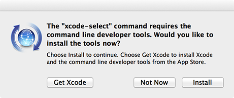
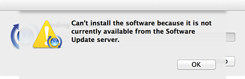
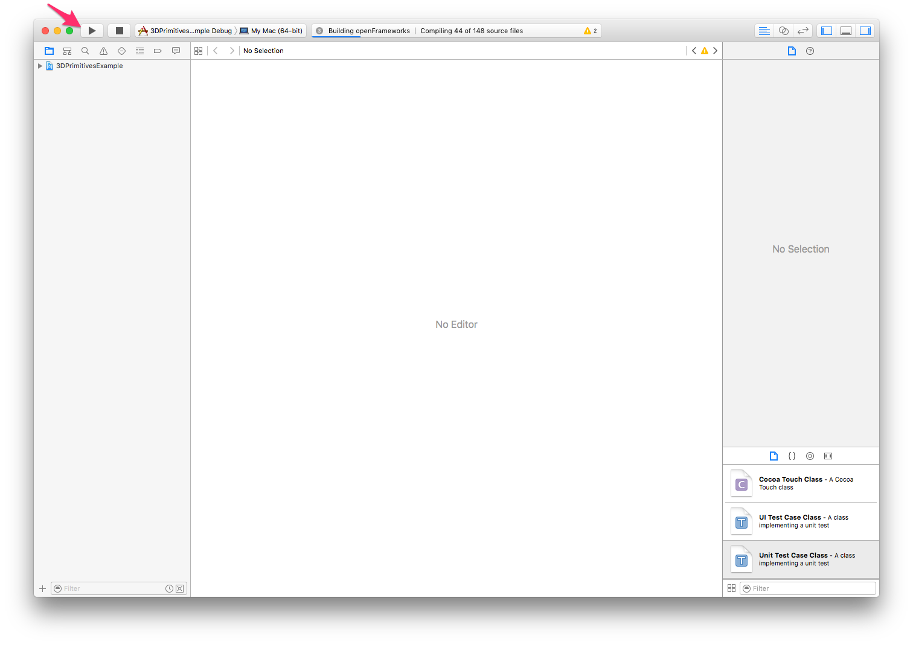
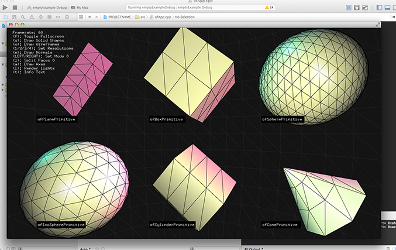

## Guia de instalação de software necessário ao workshop

De maneira a rentabilizar o numéro de conteúdos abordados no workshop, é recomendado que os participantes sigam o seguinte guia de instalação até ao fim.  Caso encontre alguma dificuldade, não se preocupe, visto que haverá tempo para resolver qualquer problema durante o workshop também.

## openFrameworks

#### OSX

1. Instalar Xcode diretamente através da [App Store](https://itunes.apple.com/ca/app/xcode/id497799835?mt=12).

  É um download grande (~5GB), portanto poderá demorar ainda algumas horas, dependendo da ligação à internet claro.

2. Instalar Xcode command line tools.

  Abrir a aplicação `Terminal` (`/Applications/Utilities/Terminal.app`) e introduzir o seguinte comando: `xcode-select --install`.

  Deverá aparecer o seguinte ecrã, onde deverá escolher a opção `Install`.

  

  É possível que lhe apareça o seguinte erro. Nesse caso é porque já tem as command line tools instaladas.

  

3. Descarregar [openFrameworks 0.9.3 para OSX]( http://openframeworks.cc/versions/v0.9.3/of_v0.9.3_osx_release.zip).

4. Garantir que a instalação está funcional, correndo o exemplo `3DPrimitivesExample`.

  Extrair `of_v0.9.3_osx_release.zip` e abir `of_v0.9.3_osx/examples/3d/3DPrimitivesExample/3DPrimitivesExample.xcodeproj` com o Xcode.

  Mandar correr o projeto, conforme indicada na figura abaixo. A primeira vez, irá demorar alguns minutos, visto que irá compilar toda a biblioteca openFrameworks. Os builds subsequentes serão significativamente mais rápidos.

  

  Deverá aparecer o seguinte ecrã. Se sim, é porque correu tudo bem e o openFrameworks e Xcode estão configurados corretamente.

  

5. _Opcional_. Instalar plugin OFXcodeMenu do Xcode.

  Este plugin facilita bastante a importação de addons a projetos já existentes.

  Descarregar diretamente [aqui](https://github.com/openframeworks/OFXcodeMenu/archive/xcode-7.3.zip).

  Para instalar basta descomprimir o zip, abrir no Xcode e correr o projeto. Da próxima vez que abrir o Xcode já haverá uma entra nova na barra de menus `OF`.

  Em caso de algum problema, por favor recorrer à documentação oficial, [aqui](https://github.com/openframeworks/OFXcodeMenu).

#### Windows

O openFrameworks em Windows pode ser usado com diferentes IDEs, mas recomenda-se o uso do Visual Studio Community 2015.

1. Descarregar e instalar [Visual Studio Community 2015](https://go.microsoft.com/fwlink/?LinkId=691978&clcid=0x409).

2. Descarregar [openFrameworks 0.9.3 para Visual Studio](http://openframeworks.cc/versions/v0.9.3/of_v0.9.3_vs_release.zip).

3. Garantir que a instalação está funcional, correndo o exemplo `3DPrimitivesExample`.

  Extrair `of_v0.9.3_vs_release.zip` e abrir `of_v0.9.3_vs/examples/3d/3DPrimitivesExample/3DPrimitivesExample.sln` com o Visual Studio Community 2015.

  Fazer build ao projeto e deverá aparecer o seguinte ecrã. Se sim, é porque correu tudo bem e o openFrameworks e Visual Studio estão configurados corretamente.

  

#### Linux

Seguir o guia de instalação oficial disponível [aqui](http://openframeworks.cc/setup/linux-install/).

## Git e Github

Apesar de que todos os comandos possam ser diretamente efetuados através de um terminal ou linha de comandos, é recomendado usar uma aplicação gráfica, especialmente para iniciantes.

#### OSX e Windows

Descarregar diretamente do site: https://desktop.github.com/.

#### Linux

Infelizmente, a aplicação `Github Desktop` - à semelhança de quase todas as outras GUI de git - não está disponível para Linux. É no entanto possível de usar o git diretamente através da linha de comandos. Para mais instruções como instalar, seguir o [documentação oficial](https://git-scm.com/download/linux).
